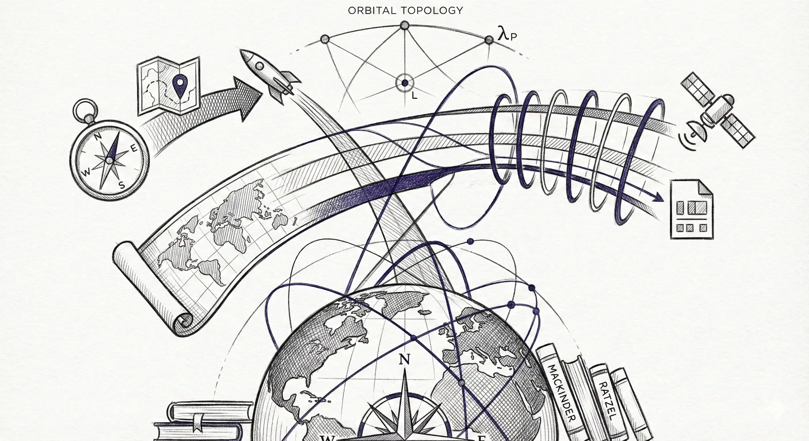

## 1. Genesi Metodologica e Logica Fondamentale

La **Geopolitica Classica** è emersa tra la fine del XIX e l'inizio del XX secolo attraverso il lavoro di Ratzel, Mahan, Mackinder, Spykman e Haushofer. Premessa fondamentale: *la geografia vincola e abilita il potere*.

* **Traduzione Spaziale:** La sfida è profonda—le teorie classiche presuppongono geografia fissa e simmetria gravitazionale. Lo spazio introduce **topologia dinamica** (le orbite decadono), **asimmetrie energetiche** (lancio dall'equatore vs. poli), e **sovranità non territoriale** (bande di frequenza, slot orbitali).
* **Funzione Epistemologica:** Produce **intelligence posizionale**—identificando quali attori controllano "terreno" strategico (siti di lancio, regimi orbitali, punti di Lagrange, poli lunari) e perché questo è importante.
* **Paradosso Fondamentale:** Lo spazio sembra eliminare i vincoli geografici ("chiunque può raggiungere l'orbita"), eppure *la meccanica orbitale reintroduce la geografia* attraverso requisiti di delta-v, penalità di inclinazione, e finestre di visibilità delle ground station.

---

## 2. Componenti Strutturali

Tre teorie fondamentali dominano, ciascuna richiedente adattamento al dominio spaziale:

### **Teoria dell'Heartland di Mackinder (1904)**
- **Logica Terrestre:** Chi controlla l'Europa Orientale controlla l'Heartland; chi controlla l'Heartland controlla la World-Island; chi controlla la World-Island controlla il mondo.
- **Analogo Spaziale:** Sostituire *orbita geostazionaria* con "Heartland"—il controllo degli slot GEO (specialmente sulle longitudini strategiche: 0°E, 60°E, 105°E per copertura Asia-Pacifico) fornisce sorveglianza persistente e dominanza nelle comunicazioni.
- **Differenza Critica:** Gli slot GEO sono *assegnabili* (coordinamento ITU), non *conquistabili*. Il potere deriva dalla cattura regolatoria, non dall'occupazione militare.

### **Teoria del Sea Power di Mahan (1890)**
- **Logica Terrestre:** La dominanza navale richiede: geografia favorevole (porti), flotta mercantile, colonie/basi, carattere nazionale incline al commercio.
- **Analogo Spaziale:** Lo "Space Power" richiede: infrastruttura di lancio (spazioporti), costellazioni satellitari commerciali, reti internazionali di ground station, cultura di tolleranza al rischio per venture NewSpace.
- **Differenza Critica:** Lo spazio non ha "choke point" come lo Stretto di Malacca—*ma* lo spettro RF e l'accesso alle ground station creano colli di bottiglia analoghi.

### **Teoria del Rimland di Spykman (1942)**
- **Logica Terrestre:** La cintura costiera eurasiatica (Rimland) è la vera area pivot; la strategia di contenimento richiede il controllo di questa periferia.
- **Analogo Spaziale:** L'**economia cislunare** (da LEO ai punti di Lagrange L1/L2) è il "Rimland" tra Terra e Deep Space. Il controllo qui determina l'accesso alle risorse lunari e alle rotte di transito verso Marte.
- **Differenza Critica:** Il Rimland era difendibile via potere navale/aereo; lo spazio cislunare *non è difendibile* in termini militari tradizionali a causa della meccanica orbitale (nessun "tenere il terreno").

---

## 3. Protocollo di Deployment

**Pre-requisiti:**
- Comprensione dei fondamenti di meccanica orbitale (budget delta-v, trasferimenti di Hohmann, cambi di inclinazione)
- Accesso a strumenti di simulazione astrodinamica (GMAT, STK, o equivalenti)
- Intelligence sulla cadenza di lancio avversaria e capacità di iniezione orbitale

**Sequenza di Esecuzione:**
1. **Inventario Geografico (Fase I):** Mappare asset strategici terrestri:
   - Siti di lancio (latitudine, vincoli di azimuth)
   - Reti di ground station (gap di copertura = punti ciechi)
   - Corridoi di sicurezza del range (restrizioni politiche di sorvolo)

2. **Analisi dei Regimi Orbitali (Fase II):** Classificare il controllo su:
   - Bande di inclinazione LEO (Sun-synchronous a 98° è premium per ISR)
   - Slot longitudinali GEO (assegnare punteggi di valore geopolitico)
   - Regioni polari lunari (illuminazione persistente = vantaggio potenza/comunicazioni)

3. **Gerarchia Delta-V (Fase III):** Calcolare la "distanza" energetica tra nodi strategici:
   - Superficie Terra → LEO: ~9.4 km/s
   - LEO → GEO: ~3.9 km/s
   - LEO → Superficie lunare: ~6.0 km/s
   - *Conclusione:* Spesso è più facile raggiungere la Luna che cambiare piani orbitali in LEO.

4. **Identificazione Chokepoint (Fase IV):** Dove la fisica o la regolamentazione creano dipendenze inevitabili?
   - Punti di Lagrange (L1, L2 come "staging post")
   - Specifiche location di ground station (es. Antartide per orbite polari)
   - Finestre di lancio (allineamento planetario per missioni su Marte)

**Formato Output:** Mappa di geografia strategica con:
- Zone di controllo codificate a colori (analoghi ai domini terra/mare/aria)
- Linee di contorno delta-v ("terreno" energetico)
- Dipendenze da percorsi critici (single point of failure)

---

## 4. Modalità di Fallimento e Vincoli

**Bias Cognitivi:**
- **Terrestrial Projection Fallacy:** Assumere che i "territori" spaziali funzionino come i territori terrestri. Lo spazio è *fluido*—le orbite precessano, decadono, e sono continuamente aggiustate. Non esiste "Fort Knox in GEO".
- **Permanence Illusion:** Le teorie classiche assumono che la geografia sia immutabile. L'infrastruttura spaziale è *consumabile*—i satelliti deorbitano, le costellazioni richiedono rifornimento costante.
- **Zero-Sum Trap:** Mackinder/Mahan assumono controllo esclusivo. Lo spazio (specialmente LEO) consente uso *concorrente* da parte di più attori nello stesso regime.

**Condizioni di Invalidazione:**
- **Breakthrough nella Propulsione:** Se la propulsione termonucleare o l'energia trasmessa riduce i costi delta-v di 10x, gli attuali vantaggi "geografici" collassano.
- **Cascata di Detriti:** Un evento di Sindrome di Kessler in LEO renderebbe obsoleti tutti gli analoghi classici—nessuno "controlla" un regime orbitale inutilizzabile.
- **Rivoluzione del Trattato:** Se l'Outer Space Treaty viene sostituito da un regime che permette sovranità (es. rivendicazioni territoriali lunari), le teorie geopolitiche *guadagnerebbero* applicabilità, non la perderebbero.

**Pattern di Uso Improprio:** Pianificatori militari che trattano lo spazio come un "high ground" da "conquistare e tenere". Lo spazio è un *mezzo di manovra*, non *terreno da occupare*. La dottrina storica "Space Superiority" dell'USAF ha commesso questo errore.

---

## 5. Punti di Integrazione

**Feeder a Monte:**
- **PESTLE Analysis (1.1):** I fattori Politici e Legali definiscono quali vantaggi "geografici" sono sfruttabili (es. ITAR restringe chi può accedere ai siti di lancio USA)

**Amplificatore a Valle:**
- **Threat Risk Assessment Matrix (4.1):** Usare insight di "geografia strategica" per identificare quali regimi orbitali gli avversari prioritizzeranno per operazioni anti-satellite (ASAT)
- **Scenario Planning (5.1):** Le teorie geopolitiche forniscono la logica strutturale per futuri alternativi (es. "Cislunare Multipolare" vs. "Duopolio Sino-Americano")

**Accoppiamento Sinergico:**
- **Instruments of National Power / DIME (2.1):** Le teorie geopolitiche identificano *dove* applicare DIME; DIME specifica *come* sfruttare i vantaggi geografici

---

## 6. Caso Esemplificativo

**Contesto:** La Space Force USA valuta il rischio strategico dalle ambizioni cislunari della Cina (2025-2035).

**Applicazione della Teoria Classica:**
- **Lente Mackinder:** La Cina che si assicura slot GEO a 87.5°E e 105.5°E (coprendo l'Asia-Pacifico) = "controllo dell'Heartland" per sorveglianza/comunicazioni regionali
- **Lente Mahan:** La base prevista da CNSA al polo sud lunare = "stazione di rifornimento" che abilita logistica Deep Space (analogo alle basi del Pacifico del XIX secolo)
- **Lente Spykman:** La stazione Tiangong della Cina in LEO + rivale pianificato di Gateway al L2 lunare = "strategia Rimland" per contenere l'accesso cislunare USA

**Insight Critico:** L'analisi iniziale trattava la base lunare come simbolica (prestigio). Il framework geopolitico l'ha rivelata come **investimento posizionale**—analogo alla Colonia del Capo britannica del XIX secolo, il polo lunare fornisce:
1. Luce solare persistente (autonomia energetica)
2. Accesso al ghiaccio d'acqua (produzione propellente)
3. Visibilità terrestre costante (nessun blackout comunicazioni)

**Implicazione Strategica:** Gli USA sono passati dal liquidare i piani lunari cinesi come "non sostenibili" al riconoscerli come *posizionamento geografico razionale* che, se riuscito, altera l'equilibrio di potere cislunare per decenni.

**Critica Red Team:** Tuttavia, l'analisi ha *sovra-applicato* gli analoghi terrestri. Diversamente dalla Colonia del Capo (difendibile), una base lunare è *cineticamente vulnerabile* a qualsiasi attore con capacità di iniezione translunare. La geopolitica classica assume difendibilità; la geografia spaziale no.

---

> **Avvertimento per Practitioner:** Le teorie geopolitiche classiche sono *metaforicamente utili* ma *analiticamente insufficienti*. Strutturano l'intuizione sul vantaggio spaziale ma devono essere subordinate alla meccanica orbitale, che è la vera "geografia" dello spazio. Non usare mai Mackinder per prevalere sull'astrodinamica.
